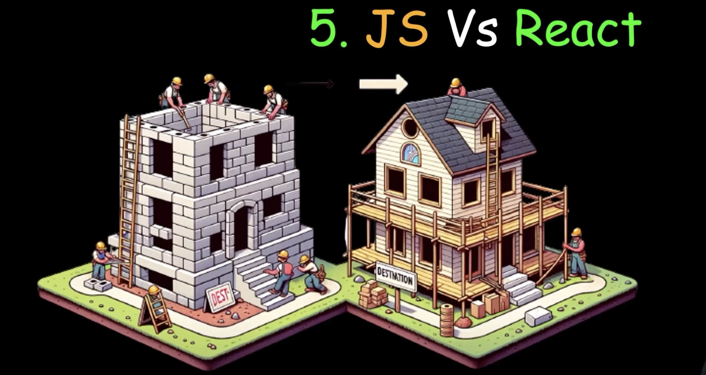

## JS is imperative: You define steps to reach your desired state
## React is declarative: You define the target UI state and then react figures out how to reach that state

Source - https://youtu.be/eILUmCJhl64?t=1254