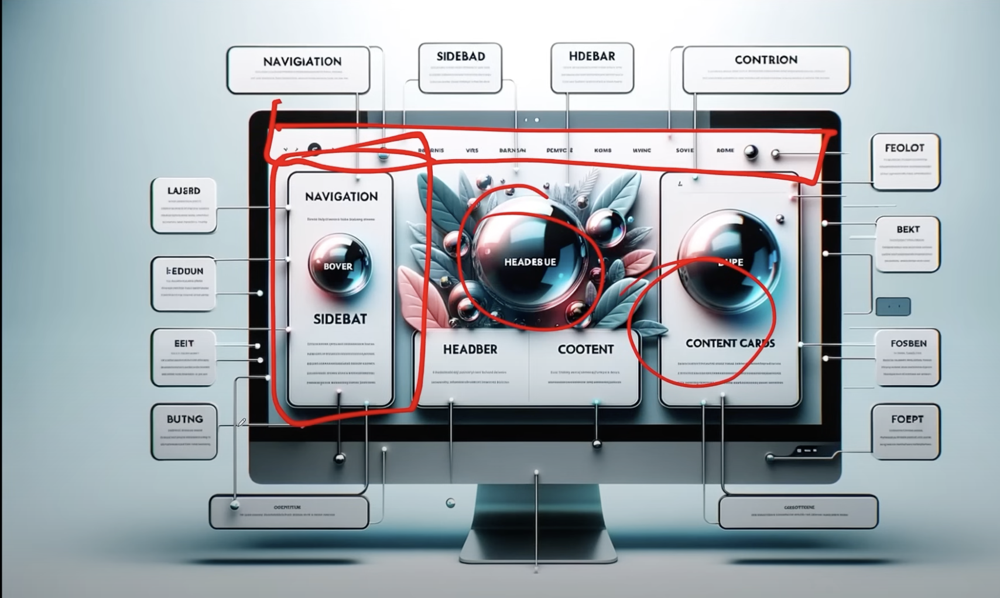

## Components helps us write reusable, modular and better organized code

## React application is a tree of components with App Component as the root bringing everything together

Source - https://youtu.be/eILUmCJhl64?t=1563
